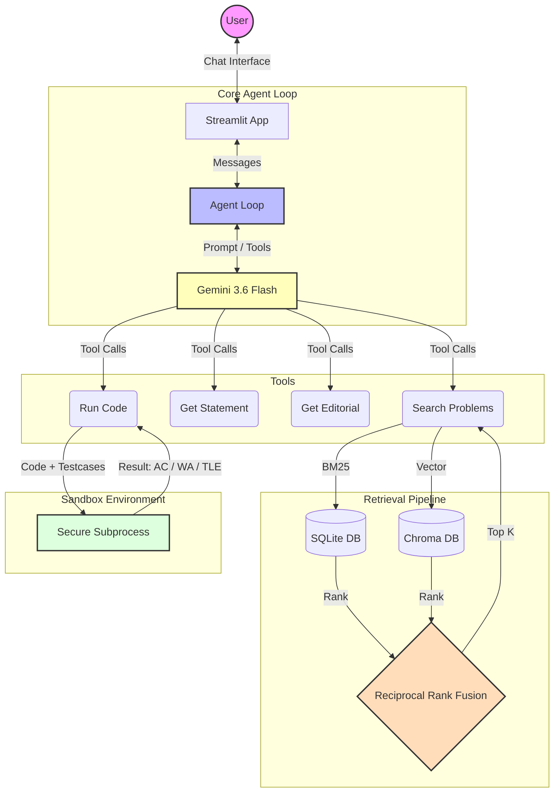

# ⚡ CF Assistant: Codeforces RAG Chatbot

An autonomous, agentic Retrieval-Augmented Generation (RAG) chatbot designed to act as your pair-programming assistant for Codeforces. Built with **Streamlit**, **Gemini 3.6 Flash**, **Chroma DB**, and **SQLite**.

The bot can search for problems semantically, fetch editorials, and run your code in a secure sandbox to verify solutions against Codeforces test cases. It implements a **Hint Ladder** approach, giving you gentle nudges rather than spoiling the answer immediately.

---

## 🏗️ Architecture



## ✨ Features

- **Hybrid Retrieval System:** Combines BM25 sparse search and Chroma DB dense vector search (using BGE embeddings) via Reciprocal Rank Fusion (RRF) for highly accurate semantic problem search.
- **Agentic Tool Use:** The LLM can autonomously decide whether to search for a problem, read its statement, fetch an editorial, or execute code to verify your logic.
- **Code Execution Sandbox:** A hardened Python/C++ sandbox that catches Time Limit Exceeded (TLE), Memory Limit Exceeded (MLE), and standard runtime errors gracefully.
- **Progressive Hint Ladder:** Slider-controlled guidance. Need a small nudge? A medium hint? Or a full explanation? You control how much the bot reveals.
- **LLM-as-a-Judge Eval Harness:** Fully evaluated generation pipeline measuring faithfulness, relevance, and non-revealing properties against a curated Golden Set.

---

## 🚀 Running Locally

### 1. Prerequisites
- Python 3.10+
- [Git](https://git-scm.com/)
- A Gemini API Key (or Groq API Key)

### 2. Installation

Clone the repository and install dependencies:
```bash
git clone https://github.com/YOUR_USERNAME/YOUR_REPO_NAME.git
cd YOUR_REPO_NAME
pip install -r requirements.txt
```

### 3. Environment Variables
Copy the `.env.example` file to `.env`:
```bash
cp .env.example .env
```
Edit `.env` and add your API key:
```ini
LLM_PROVIDER=gemini
GEMINI_API_KEY=your_gemini_key_here
GEMINI_MODEL=gemini-3.6-flash
```

### 4. Build the Database (First Run Only)
The repo does not include the large database and vector indices. You must build them locally (takes ~3 minutes):
```bash
# Ingest problems from Codeforces API to SQLite
python -m data.ingest_codeforces

# Build BM25 and Chroma vector indices
python -m retrieval.embed
```

### 5.  Streamlit Application 
https://cf-soln-chatbot.streamlit.app/


## 🧪 Running the Evaluation Harness

To run the retrieval evaluation (MRR and Recall@K):
```bash
python -m eval.retrieval_eval
```

To run the generation evaluation (LLM-as-a-judge):
```bash
python -m eval.generation_eval
```
